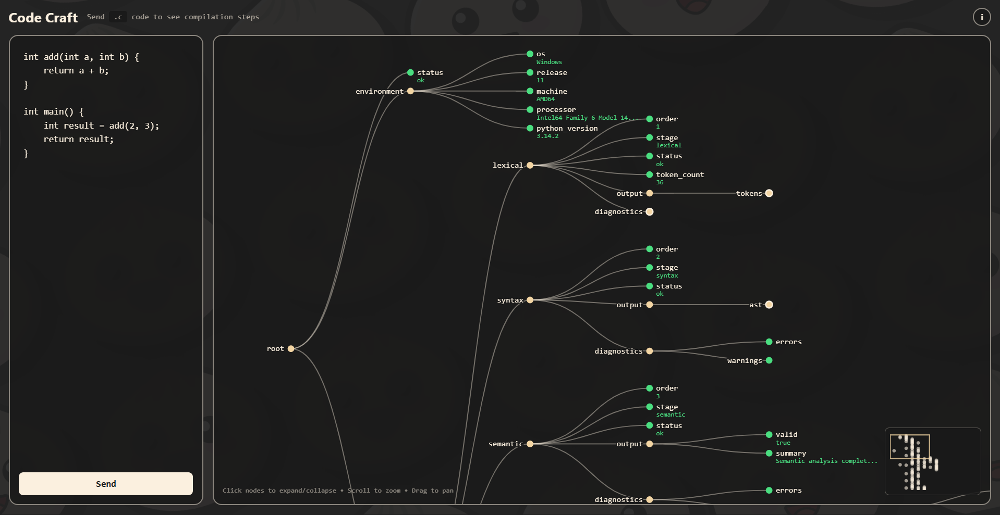

# Code Craft

A web-based C compiler visualization tool that breaks down the compilation process into interactive steps.



## Core Engine (Backend)

The backend is the heart of Code Craft, powered by Python and FastAPI. It orchestrates the entire compilation pipeline, providing a detailed look into how C code is transformed into machine instructions.

**Key Features:**

- **Full Compilation Pipeline**: Implements custom stages for:
  - Lexical Analysis (Tokenization)
  - Syntax Analysis (Parsing)
  - Semantic Analysis
  - Intermediate Code Generation
  - Code Optimization
  - Assembly Generation
- **Sandboxed Execution**: Safely compiles and runs user-submitted C code using isolated environments.
- **Detailed Analysis**: Returns structured data for every step of the compilation process, allowing for granular visualization.

## Frontend

A lightweight React application built with Bun that serves as the visual interface for the backend's analysis.

## Docker Deployment (Recommended)

To build and run the entire Code Craft ecosystem in fully containerized environments with zero local toolchain dependencies:

### 1. Build and Start the Application
```bash
docker-compose up --build
```
This single command will:
- Build and register the secure `code_craft_sandbox` execution image.
- Build and spin up the FastAPI Backend (exposing API at `http://localhost:8000`).
- Build and spin up the Bun React Frontend (accessible at `http://localhost:3000`).

### 2. Stop the Application
```bash
docker-compose down
```

## Requirements

To run Code Craft locally without Docker, you need:
- **LLVM/Clang** — For local compilation without containerization
- **MinGW GCC** — For including header files in local compilation (Windows only)